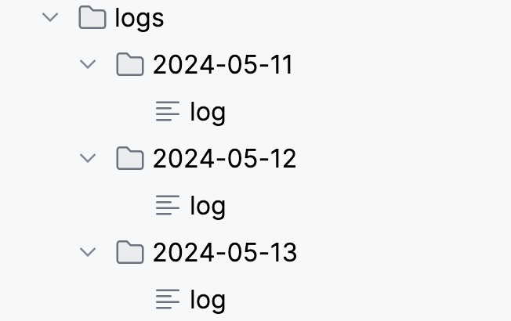

# Golog
Customized logger for go(GoLang) based on go built-in logger with the following extra features:
* Each level has prefix like [Info] and so on.
* Save log files into folders named of the date of log day.
* You can set an expiring day of log files and the expired logs will be automatically deleted.
* You can set trace data (such as request_id and user_id) to context and these trace data will be logged as prefix without explicit code.  
## Examples
* Logs can be saved as:
<div align=left>
	
</div>
* Get the module

```go
go get github.com/lgangkai/golog
```
* Create a logger

```go
import "github.com/lgangkai/golog"

// default logger with root path: "logs", log file name: "log"
// trace key: traceKey, expire day: 7
logger := golog.Default()

// or define each field by your self
logger := golog.NewLogger(true, "logs", "log", "traceKey", 7)
```
* Wrap context of your previous context with trace data from the beginning of your service. You can define you traceKey and trace date should be presented using a map.

```go
context := ... // your previous context
ctx := context.WithValue(context, "traceKey", map[string]any{
	"request_id": 123, 
	"user_id":    "456",
})
```
* Log in your code

```go
logger.Debug(ctx, "log for debug")
logger.Info(ctx, "log for info")
logger.Warning(ctx, "log for warning")
logger.Error(ctx, "log for error")
```
* Log file 
```
[Debug] 2024/05/13 02:41:46 /Users/project/go/src/golog/log_test.go:31: {request_id 123 user_id 456} log for debug
[Info] 2024/05/13 02:41:46 /Users/project/go/src/golog/log_test.go:32: {user_id 456 request_id 123} log for info
[Warning] 2024/05/13 02:41:46 /Users/project/go/src/golog/log_test.go:33: {user_id 456 request_id 123} log for warning
[Error] 2024/05/13 02:41:46 /Users/project/go/src/golog/log_test.go:34: {user_id 456 request_id 123} log for error
```